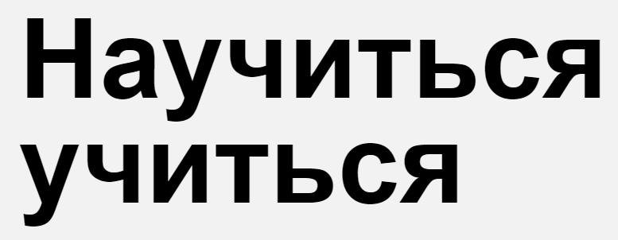

 
**Проектная работа для Яндекс.Практикум (спринты 1, 2)**  

## Описание
Проект - одностраничный сайт о том, как продуктивно учиться. В этом проекте я закрепила навыки вёрстки на флексбоксах и позиционирования элементов, научилась верстать по БЭМ, узнала, как создавать анимации и трансформации, работать с видео- и аудио-файлами.

## Используемые технологии
1. HTML5
2. Методология БЭМ
3. Флексбокс-верстка
4. CSS3-анимация

## Планы по доработке проекта
* Подключить шрифт Roboto
* Проверить код на кроссбраузерность c помощью https://autoprefixer.github.io/ru/ и дописать все вендорные префиксы
* Задизайнить форму, через которую пользователи смогут отправить комментарий

[Ссылка на проект в GitHub Pages](https://ivkrylova.github.io/how-to-learn/index.html)
